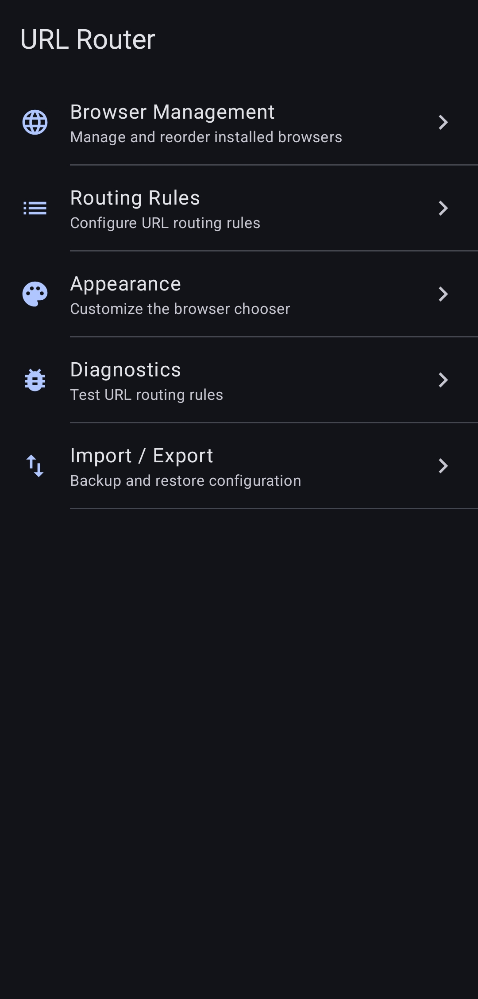
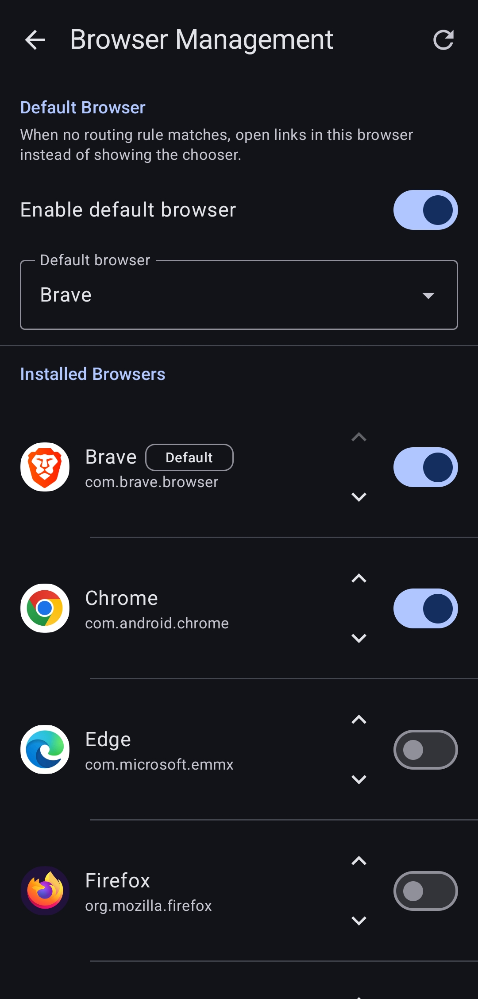
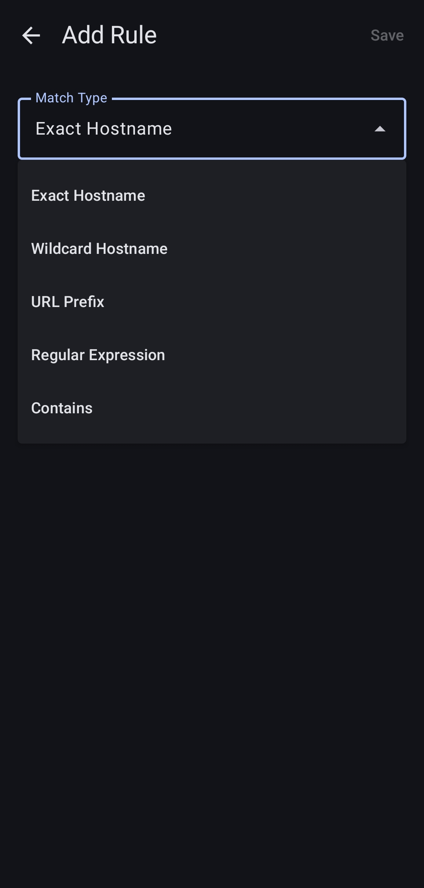
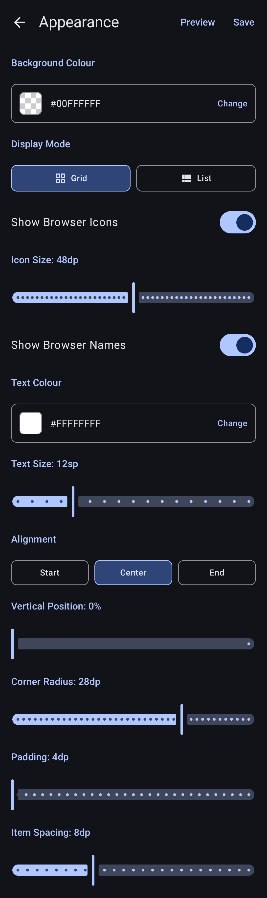

# URL Router

<p align="center">
  
</p>

<p align="center">
  A lightweight Android app that intercepts links and routes them to the right browser automatically.
</p>

---

*Dedicated to my son Mihajlo.*

*Thank you [HumanMade](https://humanmade.com/) and [Altis](https://www.altis-dxp.com/) for making the development of this app possible.*

---

## What it does

URL Router registers itself as a browser. When you open a link anywhere on Android, URL Router receives it first, evaluates your rules, and silently forwards the URL to the correct browser - with no visible UI when a rule matches.

If no rule matches, a minimal browser chooser appears so you can pick manually.

## Features

- **Rule-based routing** - route URLs by exact hostname, wildcard hostname (`*.example.com`), URL prefix, substring match, or full regex
- **Rule priority** - exact hostname → wildcard → prefix → regex → contains; first match wins
- **Default browser** - optionally define a fallback browser that opens when no rule matches, skipping the chooser entirely
- **Minimal chooser** - a clean bottom sheet with only the browsers you want; fully customisable appearance
- **No recent apps entry** - URL Router disappears after routing; it never appears in your app switcher
- **Long-press to create rule** - long-press any browser in the chooser to automatically create a rule for that domain
- **Browser management** - enable/disable browsers, set display order, rescan installed browsers
- **Appearance settings** - configure the chooser with grid or list display mode, icon size, text size and colour, vertical position, corner radius, padding, and background colour with a full HSV colour picker including transparency
- **Import / Export** - back up and restore your entire configuration using the system file picker
- **Diagnostics** - paste any URL to see exactly which rule would match and which browser would open it

## Default browser

Under **Browser Management** you can designate a default browser. When enabled, any link that doesn't match a routing rule is sent directly to the default browser - the chooser never appears. This is useful if you have one browser you use for everything except a handful of specific sites you've created rules for.

The default browser is shown with a **Default** badge in the browser list and can be changed or disabled at any time.

## Appearance

The browser chooser is fully customisable under **Appearance**:

- **Display mode** - grid (icons with optional labels) or vertical list
- **Show browser icons** - toggle icons on or off; when enabled, set the icon size
- **Show browser names** - toggle labels on or off; when enabled, set the text colour and text size
- **Alignment** - left, centre, or right
- **Vertical position** - move the chooser up from the bottom of the screen (0% = bottom, 100% = top)
- **Background colour** - full HSV colour picker with a hue bar, saturation/brightness panel, transparency slider, and hex input
- **Corner radius** - from sharp corners to a fully rounded sheet; all corners are rounded when the sheet is elevated
- **Padding and item spacing** - fine-tune the layout
- **Preview** - see your changes live before saving, using your real installed browsers

## Import / Export

Your entire configuration - routing rules, browser order, enabled browsers, and appearance settings - can be exported to a JSON file and restored later. Tap **Export** to save the file anywhere on your device (Downloads, Google Drive, etc.) using the system file picker. Tap **Import** to select a previously exported file and restore it.

## Screenshots

<p align="center">
  
  
  
  
</p>

## Requirements

- Android 8.0 (API 26) or higher
- One or more browsers installed

## Setup

1. Install URL Router
2. Open **Settings → Apps → Default apps → Browser** and select **URL Router**
3. Open URL Router and go to **Browser Management** to scan your installed browsers
4. Add routing rules under **Routing Rules**

## Building from source

### Prerequisites

- Android Studio Hedgehog or newer
- JDK 17
- Android SDK with API level 35

### Steps

```bash
git clone https://github.com/vdb86/urlrouter.git
cd urlrouter
./gradlew assembleDebug
```

The debug APK will be at `app/build/outputs/apk/debug/app-debug.apk`.

### Release build

```bash
./gradlew assembleRelease
```

You will need to configure a signing keystore. Create a `keystore.properties` file in the project root:

```properties
storeFile=path/to/your/keystore.jks
storePassword=yourStorePassword
keyAlias=yourKeyAlias
keyPassword=yourKeyPassword
```

Then update `app/build.gradle.kts` to read from it.

### Dependencies

All dependencies are open source and fetched from Maven Central / Google Maven:

| Library | License |
|---|---|
| Jetpack Compose | Apache-2.0 |
| Material 3 | Apache-2.0 |
| Navigation Compose | Apache-2.0 |
| Room | Apache-2.0 |
| DataStore | Apache-2.0 |
| Coil | Apache-2.0 |
| Gson | Apache-2.0 |
| Kotlin Coroutines | Apache-2.0 |

## Rule types

| Type | Example pattern | Matches |
|---|---|---|
| Exact hostname | `google.com` | `https://google.com/search?q=...` |
| Wildcard hostname | `*.youtube.com` | `https://m.youtube.com/watch?v=...` |
| URL prefix | `https://youtube.com/watch` | Any YouTube video URL |
| Contains | `reddit` | Any URL containing "reddit" |
| Regular expression | `.*github\.com/.*issues.*` | GitHub issue pages |

Rules are evaluated in the order shown above. Within the same type, the first rule in the list wins.

## Privacy

URL Router processes all URLs locally on your device. No data is sent anywhere. No analytics. No tracking.

## License

[GPL-3.0](LICENSE)

## Contributing

Issues and pull requests are welcome. Please open an issue before submitting a large change.